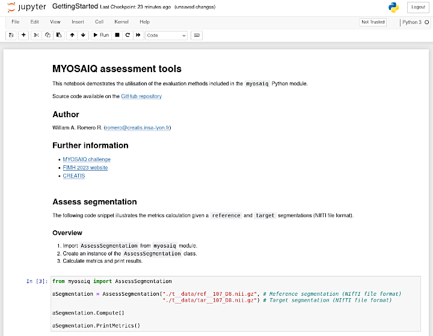

# MYOSAIQ assessment tools

Python module for assessing segmentations (MYOSAIQ Challenge 2023).

[](http://www.cecill.info/index.en.html)


## Contributors

* [William A. Romero R.](https://github.com/waromero)
* [Olivier Bernard](https://www.creatis.insa-lyon.fr/~bernard/contact.html)


## Acknowledgments

*CREATIS* - Centre de Recherche en Acquisition et Traitement de l'Image pour la Santé
CNRS UMR 5220 - INSERM U1294 - Université Lyon 1 - INSA Lyon - Université Jean Monnet Saint-Etienne
FRANCE 

## Further information

- [MYOSAIQ challenge](https://www.creatis.insa-lyon.fr/Challenge/myosaiq/)
- [FIMH 2023 website](https://fimh2023.sciencesconf.org) 
- [CREATIS](https://www.creatis.insa-lyon.fr/)


# Getting started

Quick overview of the command-line options for evaluating segmentations.

## Assess segmentation

The following command-line calculates and displays the evaluation metrics from a ```reference``` and ```target``` segmentations (NIfTI file format).

```
[mainframe@user myosaiq]$ ./aseg_single.py -r ./references/RefSegmentation_01.nii.gz -t ./TarSegmentation.nii.gz

[AssessSegmentation]

Reference segmentation (file path) : 
        ./t__data/ref__107_D8.nii.gz

Target segmentation (file path) : 
        ./t__data/tar__107_D8.nii.gz


SEGMENTATION ID    LABEL       METRIC       VALUE       STD        

ref__107_D8         LV         VOLUME       159.6       0          
ref__107_D8         MYO        VOLUME       133.6       0          
ref__107_D8         MI         VOLUME       34.2        0          
ref__107_D8         MVO        VOLUME       13.0        0          

ref__107_D8         LV       VOLUME AD      0.7         0          
ref__107_D8         MYO      VOLUME AD      3.1         0          
ref__107_D8         MI       VOLUME AD      0.2         0          
ref__107_D8         MVO      VOLUME AD      0.1         0          

ref__107_D8         LV          DICE        0.995       0          
ref__107_D8         MYO         DICE        0.985       0          
ref__107_D8         MI          DICE        0.995       0          
ref__107_D8         MVO         DICE        0.984       0          

ref__107_D8         LV          ASSD        0.034       0          
ref__107_D8         MYO         ASSD        0.039       0          
ref__107_D8         MI          ASSD        0.006       0          
ref__107_D8         MVO         ASSD        0.027       0          

ref__107_D8         LV           HD         5.634       0          
ref__107_D8         MYO          HD         5.896       0          
ref__107_D8         MI           HD         5.0         0          
ref__107_D8         MVO          HD         3.494       0          

tar__107_D8         LV         VOLUME       160.3       0          
tar__107_D8         MYO        VOLUME       130.5       0          
tar__107_D8         MI         VOLUME       34.0        0          
tar__107_D8         MVO        VOLUME       12.8        0          

tar__107_D8         LV       VOLUME AD      0.7         0          
tar__107_D8         MYO      VOLUME AD      3.1         0          
tar__107_D8         MI       VOLUME AD      0.2         0          
tar__107_D8         MVO      VOLUME AD      0.1         0          

tar__107_D8         LV          DICE        0.995       0          
tar__107_D8         MYO         DICE        0.985       0          
tar__107_D8         MI          DICE        0.995       0          
tar__107_D8         MVO         DICE        0.984       0          

tar__107_D8         LV          ASSD        0.034       0          
tar__107_D8         MYO         ASSD        0.039       0          
tar__107_D8         MI          ASSD        0.006       0          
tar__107_D8         MVO         ASSD        0.027       0          

tar__107_D8         LV           HD         5.634       0          
tar__107_D8         MYO          HD         5.896       0          
tar__107_D8         MI           HD         5.0         0          
tar__107_D8         MVO          HD         3.494       0 

```

## Calculate Continuous Ranked Probability Score (CRPS).

The following command-line calculates and displays the CRPS based on a file with cumulative distributions (CSV file format).

### Input file format

```
    ID,      VOL,     P0,     P1,     P2,  ... ,  P599
709_D8, 135.4000, 0.0001, 0.0001, 0.0001,  ... , 1.000
718_D8, 189.4000, 0.0000, 0.0000, 0.0001,  ... , 1.000
727_D8, 162.4000, 0.0000, 0.0000, 0.0003,  ... , 1.000
```

### Command-line

```
[mainframe@user myosaiq]$ ./calc_crps.py -f ./t__data/t__LV_volumes-case_actualEst.csv 
[VolumesCDF] Number of volumes: 3
[VolumesCDF] Calculating CRPS ...

        Reading data from 709_D8 (135.4000 mL) ...
        Reading data from 718_D8 (189.8000 mL) ...
        Reading data from 727_D8 (162.6000 mL) ...

CRPS = 0.0153

```

## Assess a set of segmentations

The following command-line calculates the evaluation metrics from a CSV file including a list of ```(reference, target)``` files.


### Input file format

```
           REFERENCE,                  TARGET
./ref/R709_D8.nii.gz, ./output/T709_D8.nii.gz 
./ref/R718_D8.nii.gz, ./output/T718_D8.nii.gz
./ref/R727_D8.nii.gz, ./output/T727_D8.nii.gz
```

### Command-line

```
[mrcreatis@localhost myosaiq]$ ./aseg_list.py -i ./Segmentations.csv -o ./ResultsSegmentations.csv  

[AssessSegmentations]

Input file: 
        ./t__data/t__segmentations.csv

Contents (File paths REFERENCE <- TARGET) : 
        ./ref/R709_D8.nii.gz  <-  ./output/T709_D8.nii.gz 
        ./ref/R718_D8.nii.gz  <-  ./output/T718_D8.nii.gz
        ./ref/R727_D8.nii.gz  <-  ./output/T727_D8.nii.gz        

Total: 3 segmentations.

[AssessSegmentations::ToCSV] Results to CSV file done!
```

## Jupiter Notebook

A Jupiter Notebook (```MYOSAIQ-Getting_Started_Notebook.ipynb```) has been included in order to illustrate the utilisation of the ```myosaiq``` module.


[](MYOSAIQ-Getting_Started_Notebook.ipynb "Getting started")